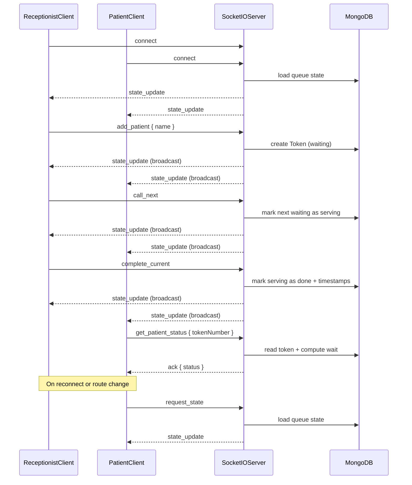

# Socket Event Diagram

## Overview

All clients connect to the same Socket.IO server. The server is the single source of truth; every mutation updates MongoDB and broadcasts fresh state to all connected screens.



## Client → Server Events

| Event | Payload | Description |
|-------|---------|-------------|
| `add_patient` | `{ name: string }` | Add patient to queue with next token number |
| `call_next` | `{}` | Call the next waiting token to consultation |
| `complete_current` | `{}` | Mark current serving patient as done |
| `set_avg_time` | `{ minutes: number }` | Set default average consultation minutes |
| `remove_token` | `{ number: number }` | Remove a waiting token (no-show) |
| `get_patient_status` | `{ tokenNumber: number }` | Get personalized wait info for a token |
| `request_state` | `{}` | Request latest queue snapshot (used on reconnect / tab switch) |

Mutation events and `request_state` support an optional acknowledgment callback: `ack({ ok, state?, message? })`.

## Server → Client Events

| Event | Payload | Description |
|-------|---------|-------------|
| `state_update` | Queue state object | Full queue snapshot after any change or on connect |
| `error_message` | `{ message: string }` | Action failed for the requesting client |

## `state_update` Payload Shape

```json
{
  "nowServing": {
    "number": 4,
    "name": "Ravi",
    "calledAt": "2026-06-18T12:00:00.000Z",
    "remainingMin": 6.5
  },
  "waiting": [
    {
      "number": 5,
      "name": "Priya",
      "position": 1,
      "estimatedWaitMin": 6.5
    }
  ],
  "avgUsedMinutes": 10,
  "isDataDriven": true,
  "sampleCount": 8,
  "settingsAvg": 10,
  "totalDone": 12,
  "updatedAt": "2026-06-18T12:05:00.000Z"
}
```

## Reconnection Behavior

On `connect`, the server immediately emits `state_update` with the latest MongoDB state. Clients re-render from this snapshot — no manual refresh required.
